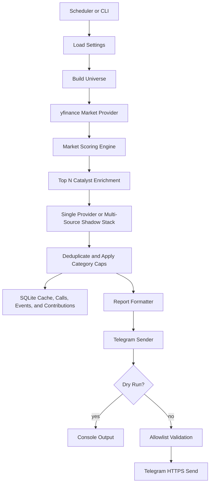

# Stock Analyzer Architecture

## Purpose

Stock Analyzer is a Telegram-first research assistant for finding high-upside stock opportunities while keeping position sizing small and controlled. The system is designed to scan a broad universe, identify rapid-upside candidates, enrich them with catalyst/risk signals, store an audit trail, and send concise alerts.

The project is currently research-only. It does not connect to a broker, does not place trades, and does not provide financial advice.

## Product Goal

The long-term goal is an autonomous investing agent with strict human and technical guardrails:

1. Scan S&P 500 plus hot non-S&P names every few hours.
2. Detect high-potential momentum, breakout, and catalyst setups.
3. Explain why a stock is moving.
4. Suggest small starter allocations such as `$250`.
5. Track manually supplied portfolio holdings.
6. Recommend hold, trim, exit-review, or watch actions.
7. Eventually support broker integration only after paper-trading, audit, and approval workflows are proven.

## Current Status

Current stage: **research scanner with production SEC enrichment and a multi-source shadow stack**.

Implemented:

- Python CLI application.
- S&P 500 universe builder.
- Hot watchlist symbols such as `SMCI`, `ARM`, `SOUN`, `MU`, `SNDK`, `MRVL`, `INTC`.
- yfinance market data provider.
- deterministic rapid-upside scoring engine.
- SEC EDGAR catalyst/risk provider.
- SEC XBRL fundamentals, 8-K item interpretation, and Form 4 transaction parsing.
- calibrated Finnhub news/earnings/recommendation provider.
- Marketaux, Alpha Vantage, and FRED provider implementations and smoke tests.
- bounded multi-source contribution aggregation and cross-source event deduplication.
- persistent provider cache, call audit, normalized events, score contributions, and shadow reviews.
- market-data retry, coverage auditing, and degraded-scan candidate suppression.
- automatic 1/3/5/10/21-trading-day forward outcome measurement.
- privacy-minimized personal portfolio snapshots and review monitoring.
- optional FMP catalyst provider code path.
- FMP endpoint smoke test command.
- SQLite audit history.
- Telegram sender with live-mode config validation and chat allowlist.
- `telegram-test` command for one-message live verification.
- `telegram-chat-id` command for retrieving recent bot chat IDs.
- targeted symbol scans with `--symbols`.
- scheduled loop command.
- OCI `systemd` service/timer templates.
- GitHub Actions test workflow.
- unit tests.

Not implemented yet:

- live Telegram bot credentials/config on your server.
- OpenAI/LLM explanation layer.
- completed seven-day multi-source shadow evaluation.
- portfolio tracking.
- sell/trim rules.
- broker integration.
- OCI deployment automation.

## Technology Stack

### Runtime

- **Python 3.10+**
  - Main application language.
  - Chosen for market-data, scoring, pandas/numpy, and fast research iteration.

- **yfinance**
  - Current free market-data source.
  - Used for price, OHLCV bars, volume, and historical trend calculations.
  - Good for MVP research; not a production-grade data source.

- **pandas / numpy**
  - Data-frame processing and numerical scoring.

- **SQLite**
  - Current storage engine.
  - Stores scan runs and per-symbol score details.
  - Chosen because it is free, simple, serverless, portable, and enough for 3-hour scans.

- **requests**
  - HTTP client for SEC, Telegram, and future API providers.

- **Telegram Bot API**
  - Alert transport.
  - Current code sends messages only when `TELEGRAM_BOT_TOKEN`, `TELEGRAM_CHAT_ID`, and `ALLOWED_TELEGRAM_CHAT_IDS` are safely configured.

### Catalyst Providers

- **SEC EDGAR**
  - Current default free catalyst/risk provider.
  - Looks for recent filings such as `8-K`, `6-K`, `10-Q`, `10-K`, `13D/13G`, `S-1`, `S-3`, `424B*`, and `144`.

- **FMP**
  - Optional future paid/low-cost provider.
  - Code path exists but is inactive until `FMP_API_KEY` is set and `STOCK_ANALYZER_CATALYST_PROVIDER=fmp`.
  - Intended for news, earnings, analyst grades, and price targets.
  - Should be used on a short top-ranked list first to control call volume.

- **Finnhub**
  - Optional bake-off provider.
  - Code path is inactive until `FINNHUB_API_KEY` is set and `STOCK_ANALYZER_CATALYST_PROVIDER=finnhub`.
  - Uses relevant company news, earnings calendar, and recommendation changes.
  - Price targets remain smoke-test-only because the endpoint is premium.
  - Is capped to five enriched symbols by default.

- **Marketaux**
  - Optional free news bake-off provider.
  - Uses entity match score, sentiment, and similar-story grouping.
  - Is capped to five symbols and one request per symbol per scan.

- **Alpha Vantage**
  - Optional daily fundamental and estimate-revision provider.
  - Uses `OVERVIEW` and `EARNINGS_ESTIMATES`.
  - Caches for 24 hours and enforces a hard 20-call daily budget.
  - Spaces remote calls by at least 12.5 seconds to respect free-tier throttling.

- **FRED**
  - Optional 12-hour market-regime provider.
  - Tracks VIX, Treasury yields, high-yield spread, and fed funds.
  - Combines them with SPY, QQQ, IWM, and SOXX trends.
  - Can only reduce scores or add risk context.

### Future Technologies

- **OpenAI API**
  - Future explanation layer.
  - Should summarize already-computed facts rather than inventing investment decisions.

- **Hermes Agent**
  - Future agent wrapper/orchestration layer.
  - Good fit for Telegram-style agent interaction and scheduled automations.

- **OCI Always Free VM**
  - Intended deployment target.
  - Runs scheduled scanner, SQLite storage, and Telegram alert process.

- **Postgres**
  - Future storage upgrade only if needed.
  - Useful for multi-user dashboards, broker logs, portfolio audit trails, or concurrent workers.

## Repository Topology

```text
stock_analyzer/
  app.py                  CLI entry point and orchestration
  config.py               environment/config loading
  database.py             SQLite schema and persistence
  models.py               shared score/catalyst models
  reporting.py            Telegram/report text formatting
  scoring.py              market scoring engine
  telegram.py             Telegram sender
  universe.py             S&P 500 and custom universe builder
  providers/
    base.py               market data provider interface
    yfinance_provider.py  yfinance implementation
  catalysts/
    aggregation.py        category and total score caps
    base.py               catalyst provider interface
    models.py             structured evidence models
    news.py               relevance, clustering, recency, and news scoring
    scoring.py            catalyst score blending
    sec_provider.py       SEC EDGAR enrichment
    finnhub_provider.py   optional Finnhub enrichment
    marketaux_provider.py optional entity-matched news
    alpha_vantage_provider.py optional daily fundamentals
    fred_provider.py      optional market regime
    composite_provider.py multi-source shadow aggregation
    fmp_provider.py       optional FMP enrichment
tests/
  test_app.py
  test_catalysts.py
  test_config.py
  test_reporting.py
  test_scoring.py
  test_sec_provider.py
  test_telegram.py
  test_universe.py
deploy/
  stock-analyzer.env.example
  systemd/
    stock-analyzer.service
    stock-analyzer.timer
.github/
  workflows/tests.yml
  dependabot.yml
```

## Runtime Data Flow



## Deployment Topologies

### Local Development Topology

```text
Developer laptop
  -> Python virtualenv
  -> yfinance + SEC network calls
  -> SQLite file under data/
  -> dry-run console output
```

Used for:

- tuning scores.
- testing baskets.
- running unit tests.
- validating providers.

Example:

```bash
python -m stock_analyzer.app run-once --dry-run --symbols ARM,MRVL,MU,SOUN,SMCI --top-n 5
```

### OCI MVP Topology

```text
OCI Always Free VM
  -> systemd service or timer
  -> Python application
  -> SQLite database on VM disk
  -> outbound HTTPS to yfinance / SEC / Telegram
  -> Telegram alerts to user
  -> no inbound ports for MVP
```

This is the recommended first deployment because it is cheap and operationally simple.

### Future Agent Topology

```text
Hermes Agent / Telegram
  -> command interface
  -> scanner service
  -> portfolio state
  -> scoring engine
  -> catalyst providers
  -> OpenAI explanation layer
  -> approval workflow
```

This phase turns the scanner into a conversational analyst.

### Future Autonomous Trading Topology

```text
Signal service
  -> portfolio/risk engine
  -> broker adapter
  -> approval queue
  -> execution guardrails
  -> audit log
```

This topology should not be implemented until the scanner has been paper-traded and validated over time.

## Scoring Topology

The scoring engine has two main layers.

### Market Score

Inputs:

- 5d, 10d, 21d, 63d, 126d, 252d returns.
- relative strength versus `SPY`.
- distance to 20d, 55d, and 252d highs.
- volume expansion.
- up/down volume.
- OBV-style accumulation.
- EMA trend quality across 10/21/50/150/200.
- EMA slopes.
- momentum acceleration.
- liquidity.
- volatility.
- ATR.
- drawdown.
- stale-data checks.

Output:

- score from 0 to 100.
- setup label such as `relative strength leader`, `breakout momentum`, or `rapid acceleration`.
- risk label such as `low`, `medium`, `high`, or `speculative`.

### Catalyst Score

Inputs:

- SEC filings, XBRL fundamentals, and insider transactions.
- relevant and deduplicated news.
- earnings events and estimate revisions.
- downside-only market regime.

Output:

- bounded score adjustment.
- catalyst reasons.
- catalyst risks.
- event list.

Guardrail:

- catalysts can lift a strong `watch` into `candidate`.
- catalysts cannot turn a weak `skip` into an automatic `$250 candidate`.
- total catalyst enrichment is capped at `-15/+10`.
- macro context cannot add positive points.
- shadow-only providers cannot send Telegram messages.

## Current Data Sources

### yfinance

Used for:

- price history.
- volume history.
- market momentum.
- volatility.
- trend.

Limitations:

- unofficial Yahoo Finance wrapper.
- not guaranteed for production.
- not ideal for real-time or broker-grade decisions.

### SEC EDGAR

Used for:

- free filing-based event/risk enrichment.
- recent `8-K` / `6-K` event filings.
- recent financial filings such as `10-Q`, `10-K`, `20-F`, `40-F`.
- ownership filings such as `13D` / `13G`.
- risk filings such as `S-1`, `S-3`, `424B*`, and `144`.

Limitations:

- filings are important but not the same as market news.
- many filings are neutral and require interpretation.
- filings are not always enough to explain intraday price movement.

### FMP Optional

Intended for:

- stock news.
- earnings events.
- analyst grades.
- price targets.
- financial market news.

Limitations:

- free tier may not be enough for every-3-hour enrichment across many tickers.
- should be used only for a short top-ranked list to control cost.

### Finnhub Optional

Intended for:

- company news.
- recent and upcoming earnings-calendar events.
- recommendation-trend consensus.
- price targets when the configured plan permits access.

Operational guardrails:

- API keys are sent in a header rather than a query string.
- three enrichment calls per symbol.
- five symbols per run by default.
- partial endpoint results are retained.
- SEC remains the scheduled production default during the bake-off.

### Free-First Multi-Source Shadow Mode

`--catalyst-provider multi` composes configured sources and stores:

- provider cache payloads and timestamps.
- provider call outcome, endpoint, symbol, cache status, and item count.
- normalized news events.
- bounded per-category contributions.
- shadow run identity and manual candidate-transition reviews.

Activation requires at least seven days and twenty scans, at least 95% provider success, positive contribution p95 no higher than `+8`, zero duplicate scored stories, and review of every candidate-state change. Use `shadow-status` and `shadow-review` to operate this gate.

Only non-degraded scans count. yfinance failures are retried in smaller batches
and then individually. A run is degraded when usable universe coverage is below
the configured threshold, SPY is unavailable, or no symbols can be ranked.
Degraded runs remain in SQLite for audit but skip catalysts and suppress
candidate allocations. Use `market-health --days 7` to inspect coverage.

## Forward Outcome Measurement

Each successful scan uses its already-downloaded histories to mature earlier
signal outcomes when enough future trading bars exist. SQLite stores entry and
exit prices, absolute and SPY-relative return, maximum favorable excursion, and
maximum adverse excursion.

`outcome-status` groups these scan observations by horizon and original action.
Multiple scans of the same symbol remain auditable but are correlated, so the
later calibration phase must also cluster contiguous signal episodes before
interpreting statistical significance.

`calibration-status` now performs that clustering with a configurable 36-hour
default gap. It keeps the earliest matured observation for each episode and
horizon, then reports returns by original action and score band. Maximum
favorable excursion is bounded at zero or higher and maximum adverse excursion
at zero or lower.

## Storage Choice

SQLite is intentional for the current phase.

Reasons:

- zero server cost.
- works well on a single OCI VM.
- one file to back up.
- easy to inspect locally.
- enough for years of 3-hour scan history.
- avoids premature infrastructure complexity.

Move to Postgres when:

- multiple users exist.
- multiple workers write concurrently.
- portfolio/broker events need stronger transactional workflows.
- dashboard/API usage grows.
- audit requirements become more formal.

## Security Approach

Security should be designed as if broker integration will eventually exist, even though it does not today.

Current guardrails:

- no broker credentials.
- no automatic trades.
- secrets expected via `.env` or environment variables.
- `.env` is ignored by git.
- dry-run mode by default.
- live Telegram sends require an explicit chat allowlist.
- unknown Telegram chat IDs are rejected before network send.
- Telegram HTTP failures are reported without echoing bot tokens.
- catalyst data is bounded and heuristic.

Required future guardrails:

- never commit secrets.
- use OCI Vault or environment-managed secrets for deployed tokens.
- run with least-privilege OS user.
- outbound-only network by default.
- no public inbound API unless explicitly needed.
- encrypted backups for SQLite.
- structured logs without secrets.
- strict Telegram chat allowlist.
- command authorization for Telegram interactions.
- rate limits for commands and provider calls.
- signed/manual approval flow before any trade execution.
- immutable audit log for recommendations, approvals, and future trades.
- dependency scanning and pinned lockfiles.
- input validation for manual portfolio entries.
- strict separation between analysis, approval, and execution services.

## Manual Portfolio Roadmap

Manual portfolio mode should accept user-provided holdings:

```text
symbol, shares, average_cost, entry_date, thesis, target_horizon, max_loss_pct, trim_target_pct
```

The bot should evaluate each holding with:

- hold score.
- sell risk score.
- trim signal.
- thesis status.
- event/catalyst changes.

Suggested actions:

- `HOLD`
- `WATCH`
- `TRIM REVIEW`
- `EXIT REVIEW`

It should not say only "sell." It should state why:

```text
Action: TRIM REVIEW
Reason:
- position is up 62% in 4 weeks
- ATR and volatility are elevated
- Form 144 filing adds sale-risk signal
Suggested review:
- consider trimming 25-50% or set a trailing stop
```

## Sell Criteria Framework

Sell or trim logic should combine:

- thesis break.
- technical breakdown.
- SEC dilution/offering risk.
- earnings/guidance failure.
- relative strength deterioration.
- position over-concentration.
- stop-loss or trailing-stop breach.
- overextension after a rapid run.
- opportunity cost versus stronger candidates.

Sell recommendations should always consider:

- entry price.
- position size.
- holding horizon.
- tax impact.
- original thesis.
- user-specified max risk.

## Portfolio Privacy Boundary

Portfolio PDFs are transient input. The application does not copy, archive,
hash, cache, or persist their text or path. The only imported financial fields
allowed across the persistence boundary are:

- symbol.
- quantity.
- average cost.

Account identifiers, names, SSNs, addresses, cash, totals, gains/losses,
pending activity, tax lots, RSU grant IDs, and vesting schedules are excluded.
WMT is also excluded as a symbol because the user's WMT holdings are RSUs.
This exclusion applies before parsing, at database write boundaries, in
scanner universes, and in all dashboard and historical calculations.
Parser failures use generic page/row error codes without source text. SQLite,
the installed portfolio plist, and portfolio logs are owner-only.

Imports are preview-then-apply. Sanitized snapshot history is retained, but raw
statements are not. The portfolio monitor combines market scoring and SEC
evidence for every holding, while optional multi-source evidence is context
only for prioritized holdings until the shadow activation gate passes.

## Local Decision Cockpit

The dashboard is a separate localhost-only read model over the existing SQLite
audit trail. Flask binds to `127.0.0.1`; every dashboard database connection
uses SQLite URI `mode=ro` plus `PRAGMA query_only=ON`. The HTTP surface contains
GET endpoints only, rejects non-loopback hosts, grants no CORS access, and uses
a restrictive Content Security Policy with locally bundled assets.

Evidence classes remain explicit: SEC scans are production research,
multi-source scans are labeled shadow context, portfolio labels remain
review-only, and outcomes show sample counts and measured returns instead of
synthetic confidence. Missing fundamentals, estimates, or scenarios render as
unavailable rather than being inferred.

The analysis layer compares each scan with the previous healthy run from the
same source class. Score/rank movement, candidate transitions, new reasons,
new risks, and resolved risks are persisted with the score. This prevents a
repeated snapshot from being presented as fresh analysis and gives reports a
deterministic "what changed" layer.

Portfolio analysis completion and Telegram notification delivery are persisted
as separate statuses. A notification outage is therefore visible without
discarding a successfully computed review.

Production universe and portfolio notifications are PDF-first. ReportLab
builds each document in memory, Telegram receives it through `sendDocument`,
and the bytes are discarded immediately after delivery. The persisted status
distinguishes analysis completion, PDF generation, PDF delivery, and concise
text fallback. Shadow scans remain internal and cannot produce an actionable
Telegram PDF.

Scheduled macOS services execute from an owner-only runtime under
`~/Library/Application Support/StockAnalyzer`, not from the Desktop checkout.
The runtime contains its own virtual environment, `.env`, SQLite database,
logs, temporary workspace, and rollback backups.

## Roadmap

### Phase 1: Scanner Foundation

Status: complete.

- universe builder.
- yfinance provider.
- market scoring.
- SQLite storage.
- dry-run reports.

### Phase 2: Free Catalyst Layer

Status: complete.

- SEC EDGAR enrichment.
- catalyst score blending.
- filing-risk signals.

### Phase 3: Telegram Live Alerts

Status: complete.

- Telegram sender safety layer.
- chat allowlist validation.
- one-message test command.
- configure Telegram bot token on local/server environment.
- send a Universe Alert PDF for every completed production scan.
- send a Portfolio Alert PDF for every completed portfolio review.
- keep shadow scans internal.

### Phase 4: News And Trend Intelligence

Status: implemented in shadow mode.

- calibrated Finnhub news and earnings.
- Marketaux entity-match bake-off path.
- Alpha Vantage fundamentals and estimate revisions.
- SEC XBRL, 8-K item, Form 4, and dilution intelligence.
- FRED plus equity-benchmark market regime.
- seven-day/twenty-scan activation gate still pending.

### Phase 5: LLM Explanation Layer

Status: pending.

- OpenAI explanation of computed facts.
- no free-form trade decisions.
- cite source snippets/events.
- compare changes since last scan.

### Phase 6: Manual Portfolio Mode

Status: complete.

- privacy-minimized Fidelity position import with preview/apply.
- WMT/RSU exclusion at every boundary.
- hold/watch/buy-more/trim/exit review labels.
- action history, stability analysis, and position sizing risk.

### Phase 7: Backtesting And Calibration

Status: in progress.

- historical replay.
- false-positive analysis.
- episode-adjusted threshold tuning.
- forward performance tracking.

### Phase 8: OCI Deployment

Status: scaffolded.

- systemd service/timer.
- secret management.
- logs.
- backups.
- monitoring.

### Phase 9: Broker And Autonomous Mode

Status: future only.

- paper trading first.
- human approval required.
- broker adapter.
- risk engine.
- kill switch.
- immutable audit trail.

## Operating Principles

- Deterministic scoring before LLM explanation.
- Small starter amounts only.
- No automatic trading in early phases.
- Data-provider boundaries stay swappable.
- Every recommendation must be auditable.
- Security and safety take priority over speed.
- Cost stays controlled by enriching only shortlisted names.
